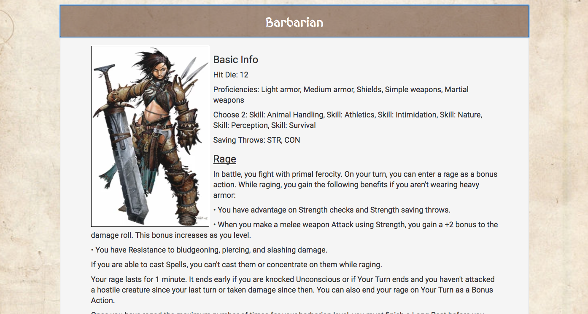

[Deployed Site](https://dungeons-and-dragons-database.firebaseapp.com/index.html)

[Wireframe](https://wireframe.cc/pro/pp/55b9ec63d94930)

[Trello Board](https://trello.com/b/9OW47ilf)

# Welcome to the Dungeons and Dragons Fifth Edition Database!

This code uses DnD5eapi found here: http://www.dnd5eapi.co/

It also contains some material from Wizards of the Coast and Paizo.

Please note that this is for educational purposes and no copyright infringement is intended.

It contains a searchable database of monsters, spells, and equipment.

It also contains a drop down menu for each player class complete with class and level information.
